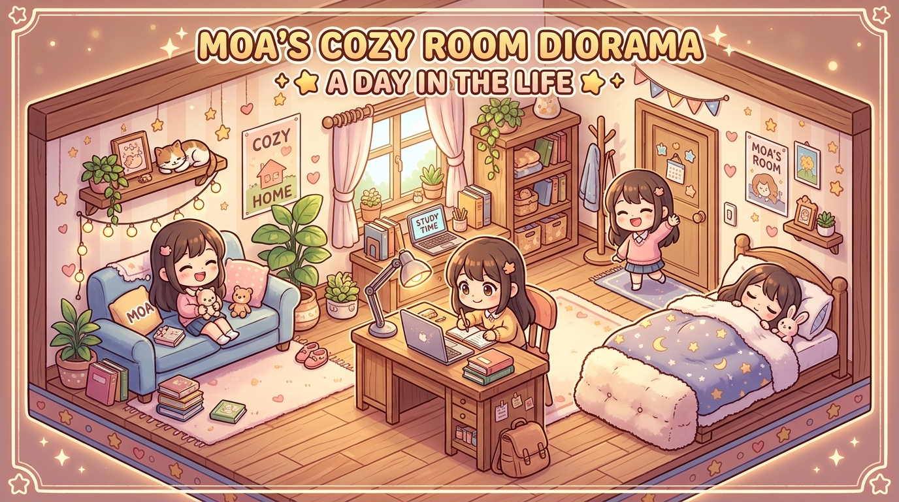

# 모아의 방



가구가 월드 오브젝트로 동작하고 캐릭터가 스스로 생활하는 **2.5D 아이소메트릭 룸 시뮬레이션**입니다. 단순 배경 이미지가 아니라 가구 점유 영역, A* 이동, 접근·사용 앵커, 깊이 정렬을 유지하면서 화면과 상호작용을 코지 라이프 게임 수준으로 다듬었습니다.

## 업그레이드된 핵심

- 에너지·집중력·편안함에 따라 침대·책상·소파를 선택하는 필요 기반 자율행동
- 접근 지점에서 사용 지점까지 부드럽게 이어지는 상호작용 전환
- 소파 앉기, 침대 눕기, 책상 공부와 인사·축하·둘러보기 제스처
- 클래식·민트·코랄 전용 `소파 착석 / 침대 수면 / 의자 공부` 포즈 시트와 진입 크로스페이드
- 침대 하체·신발을 덮는 곡선 이불 상판·주름·발치 드레이프 레이어
- 방 안 달력 클릭 → 월/날짜 선택 → 일정 메모 저장 모달
- 방 안 예산 보드 클릭 → 5개 소비 카테고리 예산·사용액·사용률 모달
- 가구 배치 미리보기와 유효·불가 색상, 겹침·접근 불가 배치 거부
- 드래그 외 방향 버튼·키보드 화살표 배치 지원
- 가구 이동 후 진행 중 경로 재계산
- 방·캐릭터 스킨 3종과 배치·상태의 `localStorage` 저장
- 데스크톱·모바일 장면 중심 UI, 375px 가로 넘침 방지, reduced-motion 대응
- 생성형 이미지로 만든 창밖 도시 풍경과 Canvas 기반 조명·러그·TV·파티클 연출

## 실행

Windows에서는 `start.bat`을 더블클릭합니다. PowerShell에서는 다음과 같이 실행할 수 있습니다.

```powershell
./start.ps1
```

브라우저 주소:

- 데스크톱: `http://127.0.0.1:8080/index.html`
- 모바일/WebView: `http://127.0.0.1:8080/widget.html`

## 검증

Node.js와 설치된 Chrome만 사용하는 무의존성 회귀 검사입니다.

```powershell
node --check src/app.js
node --test tests/smoke_test.mjs
```

검사는 실제 브라우저에서 충돌, 가구 사용, 제스처, 스킨, 저장·복원, 겹침 거부, 접근 불가 배치 거부, 375px 레이아웃, `widget.html`, 런타임 예외를 확인하고 새 미리보기 PNG를 생성합니다.

## 주요 파일

- `index.html`: 데스크톱 게임 화면
- `widget.html`: 모바일 앱/WebView용 화면
- `styles.css`: 코지 게임 UI와 반응형 스타일
- `src/app.js`: 월드 렌더링, 경로 탐색, 상태·자율행동, 배치, 저장
- `assets/characters/`: 캐릭터 스킨·포즈
- `assets/characters/*/interactions-v2.png`: 스킨별 착석·수면·공부 전용 3포즈 시트
- `assets/environment/city-window.png`: 생성형 이미지 기반 창밖 풍경
- `tests/smoke_test.mjs`: Windows용 무의존성 브라우저 회귀 검사
- `demo-interactions-and-room-tools.mp4`: 전용 포즈·달력 메모·예산 보드까지 포함한 최종 데모

## 참고한 상호작용 원칙

- Pocket Love: 작은 집, 가구 꾸미기, 캐릭터의 생활 장면 — https://hyperbeard.com/game/pocketlove/
- Adorable Home: 가구 상호작용의 가능·불가 색상 피드백 — https://hyperbeard.zendesk.com/hc/en-us/articles/35452943541399-Partner-and-Pets
- Unpacking: 시간 압박 없는 배치와 공간 적합성 — https://www.unpackinggame.com/
- The Sims 4: 선호와 쿨다운을 고려한 자율행동 — https://www.ea.com/games/the-sims/the-sims-4/news/update-3-17-2026
- Animal Crossing: Pocket Camp Complete: 가구 배치와 저장 가능한 공간 구성 — https://www.nintendo.com/en-gb/Games/Smart-device-games/Animal-Crossing-Pocket-Camp-Complete-2711347.html

위 사례의 기능 원칙만 참고했으며 이미지나 코드는 복제하지 않았습니다.

## 생성 이미지

- 방식: Codex 내장 `image_gen`
- 최종 파일: `assets/environment/city-window.png`
- 최종 프롬프트:

```text
Use case: stylized-concept
Asset type: production game environment background viewed through an apartment window
Primary request: a peaceful miniature city-and-park skyline for a cozy isometric life-simulation room
Scene/backdrop: small low-rise neighborhood, trees, distant hills, a few softly lit windows, wide sky
Subject: environment only, no room interior
Style/medium: polished soft-3D clay diorama render with simplified rounded forms, premium mobile game quality
Composition/framing: wide landscape composition, horizon in upper third, calm open center suitable for cropping inside a window; no close foreground objects
Lighting/mood: warm late-afternoon light from upper left, gentle blue-to-peach sky, quiet and welcoming
Color palette: powder blue, muted mint, warm cream, soft peach, restrained golden lights
Materials/textures: matte clay/plastic, subtle ambient occlusion, clean edges
Constraints: no characters, furniture, window frame, UI, text, logos, trademarks or watermark; original composition; no hard shadows; no depth-of-field blur
```

캐릭터 상호작용 포즈는 내장 `image_gen`으로 스킨별 한 장씩 생성했습니다.

```text
Use case: identity-preserve
Asset type: production game interaction pose sheet for a 2.5D isometric cozy-room game
Primary request: exactly three full-body poses in one horizontal sheet — sofa sit with hips/knees/feet aligned, horizontal bed sleep with eyes closed, desk-chair study with feet planted and hands toward an invisible keyboard
Style: preserve each reference character's face, hair, outfit, badge, proportions, soft-3D clay material and upper-left lighting
Background: uniform chroma magenta #FF00FF for same-origin runtime alpha extraction
Constraints: no furniture, props, crop, fake rotated standing pose, duplicate character, text, logo or watermark
```

최종 파일은 `classic/mint/coral` 폴더의 `interactions-v2.png`이며, 앱 로드 시 단색 배경을 투명 캔버스로 변환해 사용합니다.

## 현재 경계

이 결과물은 Canvas 2D 기반 2.5D 시뮬레이션입니다. 실제 3D 메시·강체·골격 애니메이션이나 LLM 에이전트는 포함하지 않습니다. 앉기·눕기·공부는 스킨별 전용 포즈와 가구 레이어링으로 표현합니다.
